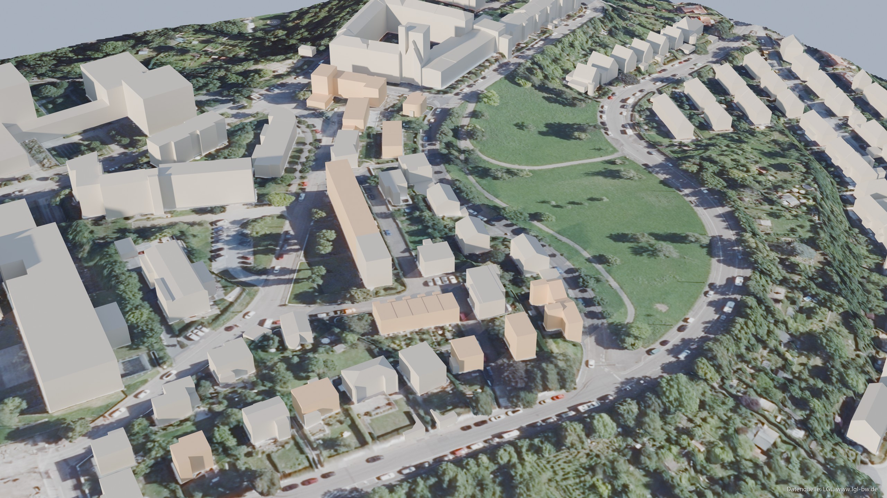
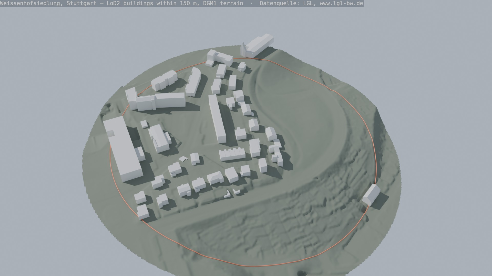
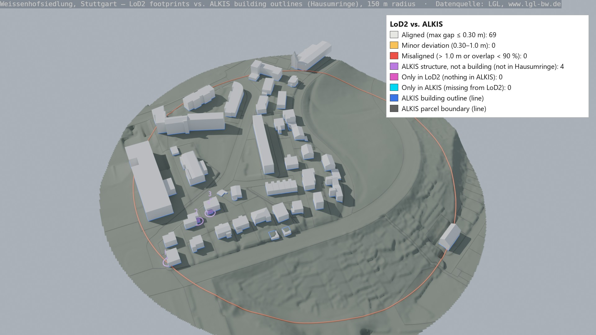
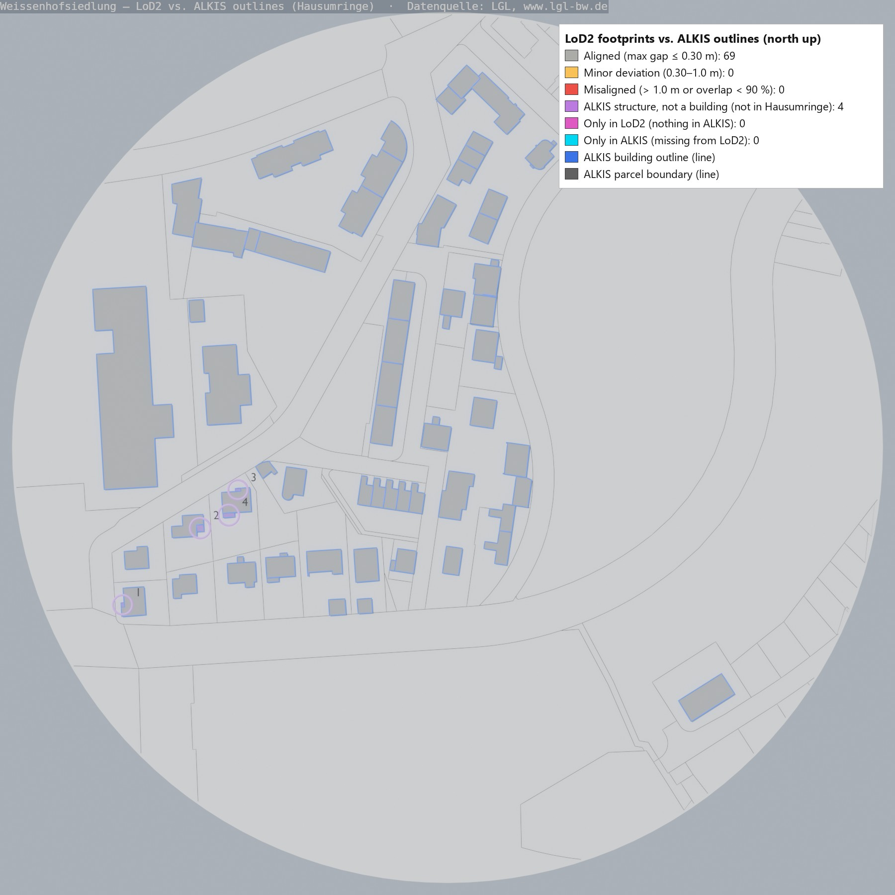
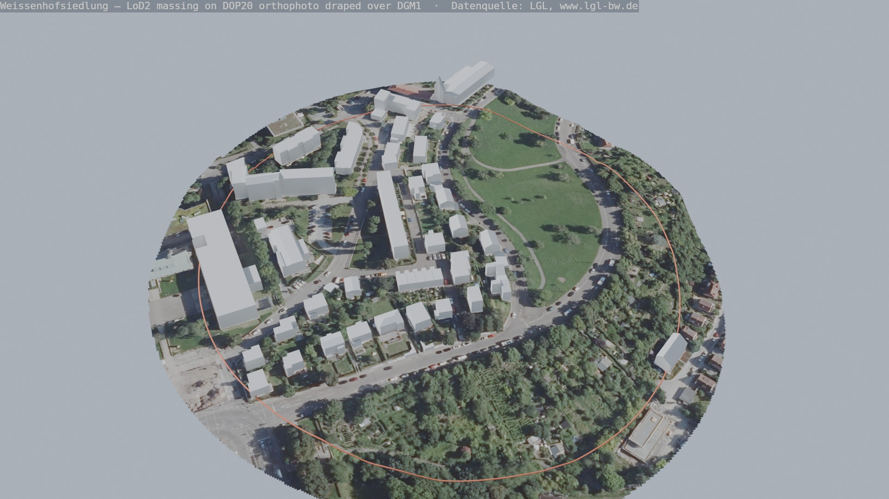
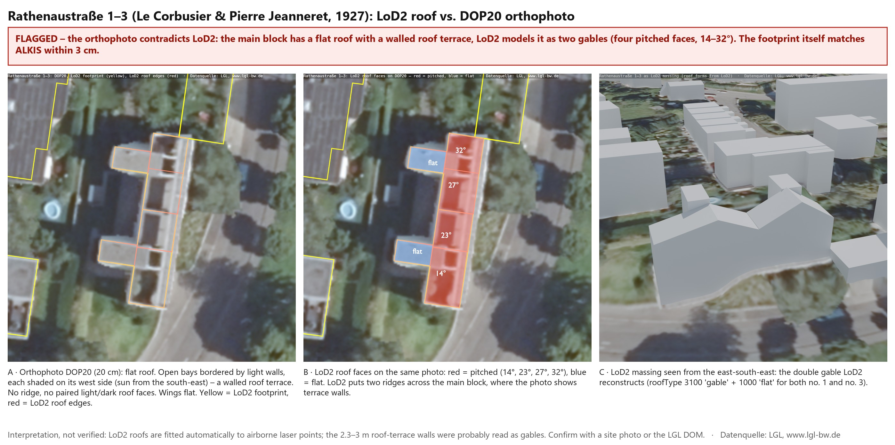
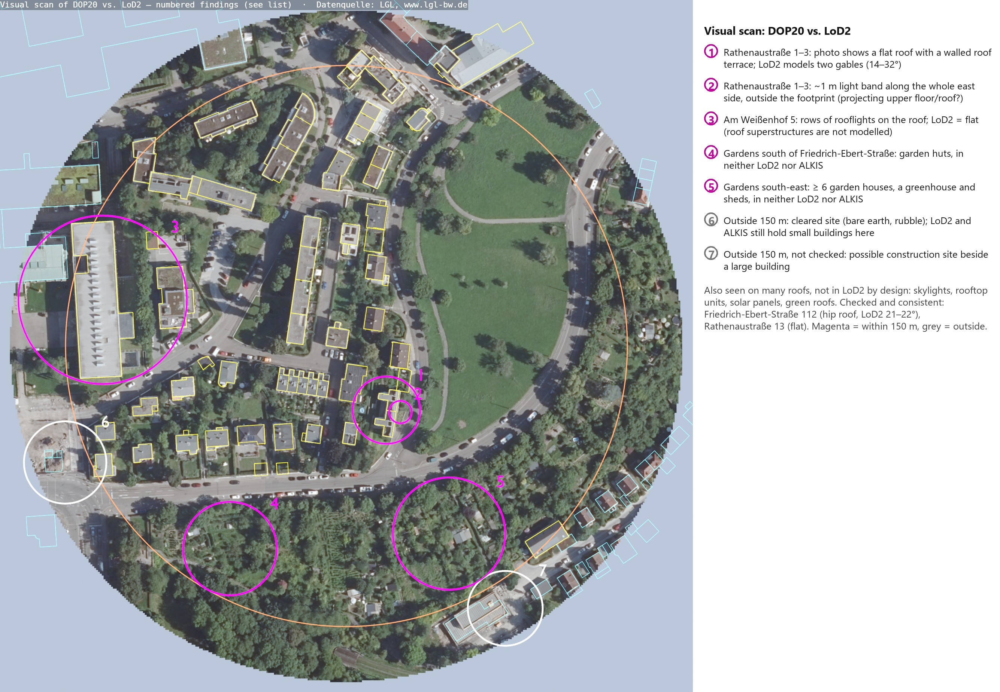

# Geodata and AI integration: the Weissenhof case study

AI tools for building permits and planning are only as good as the data under them. So how far do the official geodatasets for one site agree with each other, and with the buildings that actually stand there?

I tested this on the Weissenhofsiedlung in Stuttgart, the 1927 housing estate by Mies van der Rohe, Le Corbusier and others. Everything on this page is built from open data of the state survey office of Baden-Württemberg (LGL).

*Aerial photo, measured terrain and 3D building models combined in one scene. The 11 buildings that survive from the 1927 exhibition are shown in a warm tone, their neighbours in light stone. Datenquelle: LGL, www.lgl-bw.de*

## Findings in short

| Check | Result |
|---|---|
| Building footprints: cadastre (ALKIS) against 3D models (LoD2) | 69 of 69 buildings match, largest gap 3.4 cm |
| Classification: ALKIS against LoD2 | 4 small canopies are buildings in LoD2 but structures in ALKIS |
| Roof form: LoD2 against the aerial photo (DOP20) | LoD2 gives Le Corbusier's double house two gable roofs. The photo shows a flat roof with a walled terrace |
| What the 3D models leave out | Garden houses, rooflights, solar panels, and everything else on or between the buildings |
| Live API against my download | Same objects and IDs, same version dates for all 69 buildings |
| What the live API offers | Buildings, parcels and survey points only. No 3D models, terrain, aerial photos or canopies |
| How current the download is | The API already holds changes up to 1 October 2026 that my July download does not have |

## How it was made

Claude, connected to Blender through the Model Context Protocol (MCP), wrote and ran the scripts in this repository under my direction. I set the questions, chose the site, decided which checks to run and reviewed every result before accepting it. The list of 1927 buildings was checked by me against the building list of the Weissenhofmuseum.

Two rules applied throughout:

- **No finding without a second source.** Something seen in a render had to be confirmed in the data before it went into the notes.
- **Causes are reported only when verified.** Where I could see a mismatch but not explain it, the page says so.

**Study area:** all buildings within 150 m of the midpoint between Mies van der Rohe's apartment block (Am Weißenhof 14 to 20) and Le Corbusier's double house (Rathenaustraße 1 to 3). Coordinate system EPSG:25832, heights DHHN2016.

## The data

| Dataset | What it is | Used for |
|---|---|---|
| LoD2 | 3D building models with standard roof forms (CityGML) | Massing, roof forms, heights |
| DGM1 | Terrain model on a 1 m grid, from airborne laser scanning | Ground surface |
| ALKIS | Official cadastre: parcels and building outlines | Footprints and classification |
| DOP20 | Aerial photo at 20 cm resolution | Independent visual check |
| OGC API Features (beta) | Live access to cadastre objects | Checking how current the download is |

Tile names, dates and licence details are in [`notes/data_sources.md`](notes/data_sources.md).

## Step 1: buildings on measured terrain

*The 3D building models placed on the measured terrain. The red line marks the 150 m study radius. Datenquelle: LGL, www.lgl-bw.de*

**What it shows:** the estate sits on a slope that falls away to the south and east. Within the radius there are 73 building objects. Their 102 roof parts are 69 flat, 12 gable, 11 shed, 1 hip, 4 combined and 5 other. Heights range from 2.0 m to 22.0 m.

**First cross-check:** each building in LoD2 has one ground height. Compared with the terrain model at the same points, the two differ by 0.39 m at the median and by up to 7.16 m. The large gaps are on the slope, where a building has a single reference height while the real ground falls along its walls. For any rule that measures building height from the ground, this matters.

Script: [`scripts/import_lod2.py`](scripts/import_lod2.py)

## Step 2: do the 3D models match the cadastre?

| Oblique view | Plan |
|---|---|
|  |  |

*Blue lines are the official building outlines from ALKIS, grey lines the parcel boundaries. Grey buildings are aligned. The four numbered purple circles mark the canopies. Datenquelle: LGL, www.lgl-bw.de*

**What it shows:** every one of the 69 official buildings has a 3D model, matched by object ID. The outlines differ by 3.4 cm at most. No building is missing on either side.

**Why this is weaker evidence than it looks.** LoD2 footprints are produced from ALKIS and carry the same object IDs. The comparison shows that the copy is faithful. It does not show that either dataset matches the building on the ground. For that, an independent source is needed, which is why the aerial photo matters.

**A check that first looked like five errors.** The first run flagged five problems. Each was examined before it was reported:

- **One was a false alarm.** A building made of several parts had gaps of less than 10 cm between its parts. That produced an apparent mismatch of 4.7 m that was not real. Closing the small gaps removed it.
- **Four were real, but not geometry errors.** They are small canopies of 2.5 to 9 m². LoD2 models them as buildings. ALKIS records them as structures. Two datasets from the same office classify the same object differently.

So the 73 objects in LoD2 are 69 buildings and 4 canopies.

Scripts: [`scripts/extract_alkis.py`](scripts/extract_alkis.py), [`scripts/compare_alkis_lod2.py`](scripts/compare_alkis_lod2.py). Full table: [`notes/alkis_lod2_comparison.md`](notes/alkis_lod2_comparison.md)

## Step 3: what does the aerial photo say?

*The aerial photo draped over the terrain, with the 3D buildings standing on it. Photo, terrain and buildings share the same coordinates, so they line up without manual adjustment. Datenquelle: LGL, www.lgl-bw.de*

The aerial photo is the only dataset here that is not derived from the cadastre. It is the independent witness.

### The roof of Le Corbusier's double house

*A: the aerial photo, with the LoD2 footprint in yellow and its roof edges in red. B: the LoD2 roof faces on the same photo, red for pitched, blue for flat. C: the building as LoD2 models it. Datenquelle: LGL, www.lgl-bw.de*

**What it shows:** the house at Rathenaustraße 1 to 3 is known for its flat roof with a roof terrace. The photo shows exactly that: open bays bordered by light walls, no ridge. LoD2 models the same block with four pitched faces between 14° and 32°. The footprint is correct to 3 cm. The roof is not.

**A possible cause, not verified:** LoD2 roofs are fitted automatically to laser points. The terrace walls stand 2 to 3 m above the roof slab, about as high as the modelled slopes rise, and may have been read as gables. To confirm this, the surface model or a site photo would be needed.

This does not contradict Step 2. It completes it. The footprint is the part LoD2 copies from the cadastre. The roof is the part LoD2 adds on its own, and that is where the error is.

### A scan of the whole area

*LoD2 footprints in yellow on the aerial photo. Pink circles are findings inside the study radius, white circles are outside it. Datenquelle: LGL, www.lgl-bw.de*

| # | Where | The photo shows | The data says |
|---|---|---|---|
| 1 | Rathenaustraße 1 to 3 | Flat roof with a walled terrace | LoD2: two gables |
| 2 | Rathenaustraße 1 to 3, street side | A light band about 1 m wide outside the footprint | Not in LoD2 or ALKIS. Possibly a projecting upper floor |
| 3 | Am Weißenhof 5 | Rows of rooflights across the roof | LoD2: flat. Roof structures are not modelled |
| 4, 5 | Gardens to the south | Garden huts, a greenhouse, sheds | In neither LoD2 nor ALKIS |
| 6 | Just outside the radius | A cleared site: bare earth and rubble | LoD2 and ALKIS still hold small buildings there |

Findings 3 to 5 are expected limits of the data, not errors. Garden houses are usually too small to be surveyed. They still mean that the 3D model under-counts what is built.

Finding 6 is the one I could not resolve. It comes back in Step 4.

Script: [`scripts/render_dop20.py`](scripts/render_dop20.py). Details: [`notes/dop20_findings.md`](notes/dop20_findings.md)

## Step 4: download or live API?

LGL offers a beta OGC API Features service. I queried it for the same site on 4 October 2026, read-only, and compared it with my cadastre download from July 2026.

| Check | Result |
|---|---|
| Buildings in the wider extract square | 224 in the download, 224 in the API, identical IDs |
| Buildings in the study radius | 69 and 69, identical IDs |
| Footprint geometry | Largest gap 3.6 cm. The API gives coordinates in centimetres, the download in millimetres |
| Parcels | 181 and 181, identical IDs and official areas |
| Version dates in the study radius | 69 of 69 identical |
| Canopies | Not available. The API has buildings but no other structures |
| Speed | About 0.3 s for the area, against streaming a 1.7 GB file |

**How current is each one?** The API's newest records date from 1 October 2026, after my download. So the API is updated and is, overall, newer. But it does not state its own data date.

**One building, four answers.** The cleared site from Step 3 (Am Weißenhof 1/1, just outside the radius):

| Source | What it says |
|---|---|
| Aerial photo | The building is gone: bare earth and rubble |
| LoD2 | The building exists |
| Cadastre download, July 2026 | The building exists, in a version dated 30 June 2026 |
| Live API, October 2026 | The building exists, in a version dated 5 July 2010 |

None of the three data sources removes the building that the photo shows as gone. And the newer service holds the older version of the record. I could not determine why from the data, so I report it as an open question.

**Conclusion:** download once to understand the data and to have a dated, complete reference. Use the API for quick queries and to check what has changed.

Scripts: [`scripts/test_oaf.py`](scripts/test_oaf.py), [`scripts/check_currency.py`](scripts/check_currency.py). Details: [`notes/oaf_findings.md`](notes/oaf_findings.md)

## What the 3D models can and cannot show

- **Reliable:** positions, footprints and relative sizes of the buildings, and the layout of the estate.
- **Approximate:** heights, which come from laser scanning, and roofs, which are simplified to standard forms and can be wrong.
- **Missing:** windows, doors, balconies, pilotis, roof terraces, materials, trees and streets. The famous houses come out as correctly sized boxes.

## Why this matters for AI in permitting

A permit question needs the parcel, the building, the terrain and the rules at the same time. Today these come from different datasets with different update cycles, different classifications and different levels of detail.

- An AI system that reads only one of them will answer confidently and sometimes wrongly. On this site it would report a gable roof on a flat-roofed house, or a building on a cleared plot.
- A system that reads several can say where they disagree. That only works if it keeps the source and the date of every value.
- Agreement between two datasets is evidence only if they are independent. Here, the best-looking match (69 of 69) was between a dataset and its own copy.

## Next step

I am extending this into a second project, Rule-Aware District: one agent per data source (cadastre, 3D buildings, imagery, terrain, land use, live API) and a coordinator that reports each check as pass, fail, uncertain or no data. That project is planned, not built.

## Repository

| Folder | Content |
|---|---|
| [`scripts/`](scripts) | The seven Python scripts behind the results on this page |
| [`notes/`](notes) | The findings as written during the work, with full tables |
| [`images/`](images) | The renders shown above, and a three-slide summary in `images/carousel/` |

**Scripts in the order they run:**

| Script | What it does |
|---|---|
| `import_lod2.py` | Reads the CityGML tiles, selects the buildings in the radius, builds them on the DGM1 terrain |
| `extract_alkis.py` | Streams the cadastre file for all of Stuttgart and keeps the parcels and buildings around the site |
| `compare_alkis_lod2.py` | Matches each 3D building to its cadastre outline, measures the gap, renders the comparison |
| `render_dop20.py` | Drapes the aerial photo over the terrain and renders the comparison views |
| `render_hero.py` | Renders the image at the top of this page |
| `test_oaf.py` | Queries the live API and compares it with the download |
| `check_currency.py` | Compares the version dates of every building in both sources |

**To run them:** the scripts run inside Blender with the Bonsai extension, which provides `lxml` and `shapely`. Download the LGL tiles listed in `notes/data_sources.md` into a `data/` folder, then run for example `blender --background --python scripts/import_lod2.py` from the project root. The raw data is not stored here.

## Limits

- One site and a 150 m radius. The results describe this area, not the datasets in general.
- The roof finding rests on one aerial photo. A photo shows shape and shading, not heights.
- The API is a beta service. Its content and behaviour may change.
- This is a study of data quality. It makes no statement about the legal status of any building.

## Data credit and licence

Datenquelle: LGL, www.lgl-bw.de. The data is published under the Data licence Germany, attribution, version 2.0 (dl-de/by-2.0). All renders on this page are derived from it.

Author: Abdul Rehman, [github.com/meet-rehman](https://github.com/meet-rehman)
