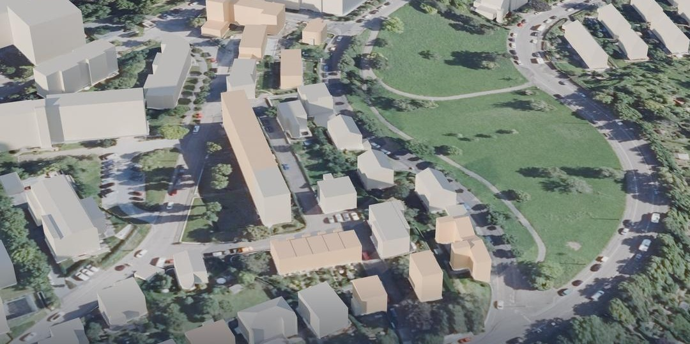
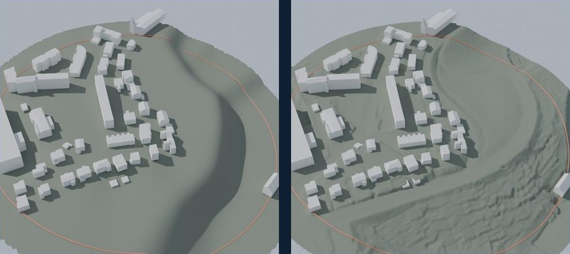

# Geodata and AI integration: the Weissenhof case study

AI tools for building permits and planning are only as good as the data under them. So how far do the official geodatasets for one site agree with each other?

I tested this on the Weissenhofsiedlung in Stuttgart, the 1927 housing estate by Mies van der Rohe, Le Corbusier and others. I used open data from the state survey office of Baden-Württemberg (LGL) and checked the same site in two ways: by downloading the data packages, and by querying the new live API.

Claude, connected to Blender through the Model Context Protocol (MCP), wrote and ran the import and comparison scripts under my direction. I set the questions and checked the results. The list of 1927 buildings was checked against the Weissenhofmuseum's records.

*Aerial photo, terrain and 3D buildings combined in one scene. The buildings of the 1927 estate that survive today are highlighted. Datenquelle: LGL, www.lgl-bw.de*

## Findings in short

| Check | Result |
|---|---|
| Footprints: cadastre (ALKIS) against 3D buildings (LoD2) | 69 of 69 buildings match, largest gap 3.4 cm |
| Classification: ALKIS against LoD2 | 4 small canopies are buildings in LoD2 but structures in ALKIS |
| Roof form: LoD2 against aerial photo (DOP20) | One mismatch found at Le Corbusier's double house, cause not verified |
| Live API against my download | Same version dates for all 69 buildings |
| What the live API offers | 2 datasets only: ALKIS and Basis-DLM. No 3D buildings, terrain or photos |
| How current the download is | The API already shows changes up to 1 October 2026 that my July download does not have |

## The data

All data is open data from LGL Baden-Württemberg.

| Dataset | What it is | Used for |
|---|---|---|
| ALKIS | Official cadastre: parcels, building footprints, land use | Footprints and classification |
| LoD2 | 3D building models with standard roof forms (CityGML) | Massing, roof forms, heights |
| DGM1 | Terrain model on a 1 m grid | Ground surface |
| DOP20 | Aerial photos at 20 cm resolution | Independent visual check |
| OGC API Features (beta) | Live access to ALKIS and Basis-DLM | Checking how current the download is |

**Study area:** all buildings within 150 m of the midpoint between Mies van der Rohe's apartment block (Am Weißenhof 14 to 20) and Le Corbusier's double house (Rathenaustraße 1 to 3). Coordinate system EPSG:25832.

**In that radius:** 73 building objects in LoD2. Their 102 roof parts are 69 flat, 12 gable, 11 shed, 1 hip, 4 combined and 5 other. Building heights range from 2.0 m to 22.0 m.

## Method 1: download the packages and combine them

*Left: LoD2 buildings only. Right: the same buildings with the measured DGM1 terrain added. Datenquelle: LGL, www.lgl-bw.de*

### Footprints match, with a caveat

All 69 buildings have the same footprint in ALKIS and in LoD2. The largest difference is 3.4 cm.

This is weaker evidence than it looks. LoD2 footprints are derived from ALKIS and carry the same object IDs. The comparison shows that the copy is faithful. It does not show that either dataset matches the building on the ground. For that, an independent source is needed, which is why the aerial photo matters.

### A check that first looked like five errors

The first comparison run flagged five problems. Before reporting them, each one was examined:

- **One was a false alarm.** A building made of several parts had gaps of less than 10 cm between its parts. That produced an apparent mismatch of 4.7 m that was not real. Closing the small gaps removed it.
- **Four were real, but not geometry errors.** They are small canopies of 2.5 to 9 m². LoD2 models them as buildings. ALKIS records them as structures. Two official datasets from the same office classify the same object differently.

So the 73 objects in LoD2 are 69 buildings and 4 canopies.

### A roof that does not match

LoD2 gives part of Rathenaustraße 1 to 3 gable roofs. Le Corbusier's double house is known for its flat roof with a roof terrace, and the DOP20 aerial photo shows a flat roof. I have not verified why the 3D model differs, so I report the mismatch without a cause.

### What LoD2 can and cannot show

- **Reliable:** positions, footprints and relative sizes of the buildings, and the layout of the estate.
- **Approximate:** heights, which come from aerial laser scanning, and roofs, which are simplified to standard forms.
- **Missing:** windows, doors, balconies, pilotis, roof terraces, materials, trees and streets. The famous houses come out as correctly sized white boxes.

## Method 2: ask the live API

LGL now offers a beta OGC API Features service. I queried it for the same site and compared it with my download from July 2026.

- It contains ALKIS and Basis-DLM only. 3D buildings, terrain and aerial photos are not available through it.
- For all 69 buildings, the version dates in the API are identical to those in my download.
- Elsewhere in the area, the API already shows changes dated up to 1 October 2026. A download is a snapshot and starts ageing on the day it is made.

**Download once to understand the data. Use the API to keep it current.**

## Why this matters for AI in permitting

A permit question needs the parcel, the building, the terrain and the rules at the same time. Today these come from different datasets with different update cycles, different classifications and different levels of detail. An AI system that reads only one of them will answer confidently and sometimes wrongly. A system that reads several can say where they disagree, but only if it knows the source and date of every value.

## Next step

I am extending this into a second project, Rule-Aware District: one agent per data source (cadastre, 3D buildings, imagery, terrain, land use, live API) and a coordinator that reports each check as pass, fail, uncertain or no data. That project is planned, not built.

## Repository

- `images/`: renders used on this page, and the three slides of the summary carousel in `images/carousel/`
- Scripts for import and comparison will be added after clean-up.

The raw data is not stored here. It can be downloaded from the LGL open data portal.

## Data credit and licence

Datenquelle: LGL, www.lgl-bw.de. The data is published under the Data licence Germany, attribution, version 2.0 (dl-de/by-2.0). All renders on this page are derived from it.

This is a study of data quality. It makes no statement about the legal status of any building.

Author: Abdul Rehman, [github.com/meet-rehman](https://github.com/meet-rehman)
